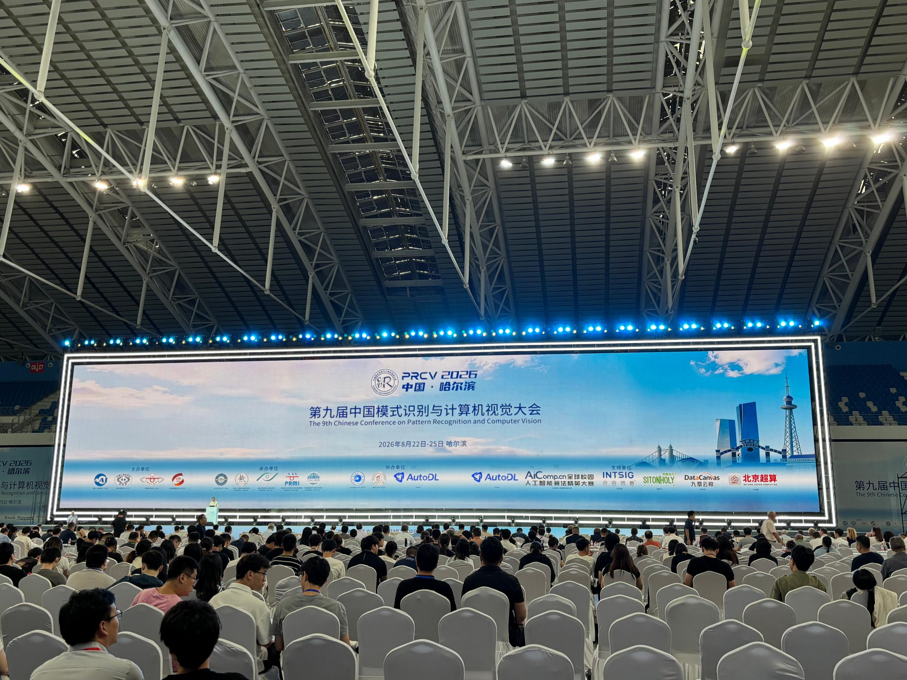
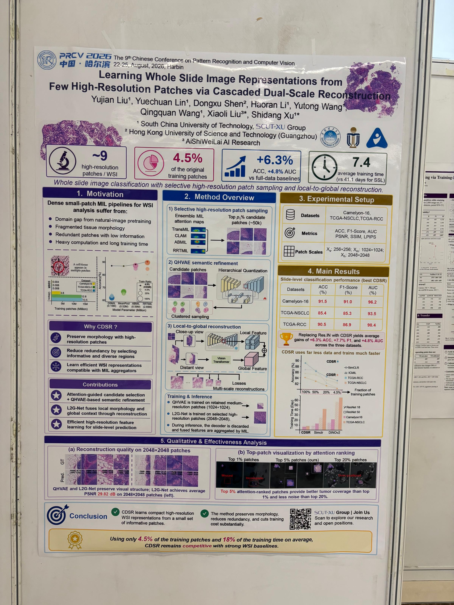

Yujian Liu Presents His Research at PRCV 2026
<!--more-->

From August 22 to 25, 2026, Yujian Liu attended the 9th Chinese Conference on Pattern Recognition and Computer Vision (PRCV 2026) in Harbin, China. He presented a poster on the work *Learning Whole Slide Image Representations from Few High-Resolution Patches via Cascaded Dual-Scale Reconstruction* and exchanged ideas with researchers in pattern recognition and computer vision.

